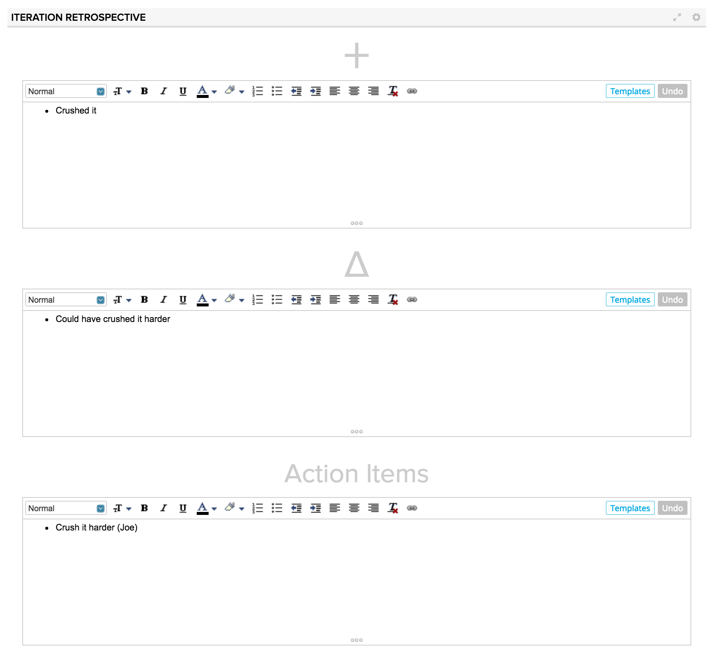
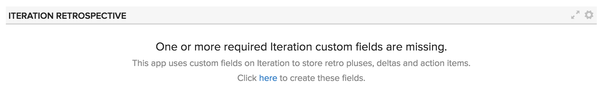
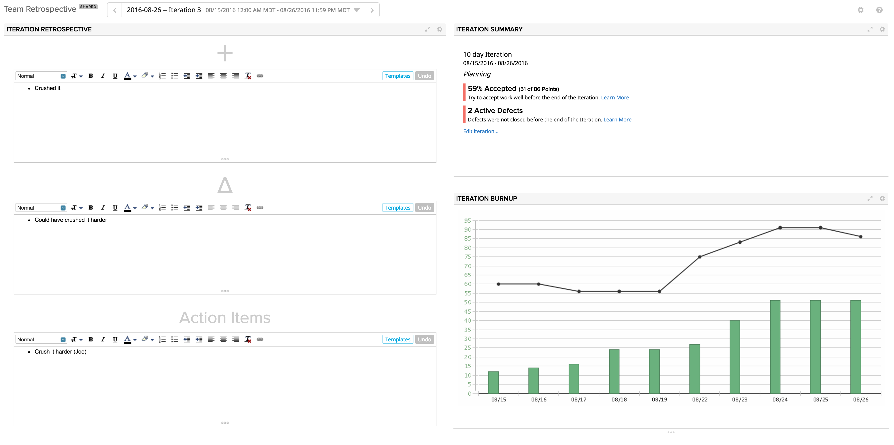

# Iteration Retrospective
An app to facilitate retrospective conversations within Agile Central.  Retrospectives are a critical ceremony for agile and lean methodologies.  This app tracks pluses, deltas and action items for each iteration using custom text fields on the Iteration object.  Say goodbye to external spreadsheets- now you can retro without leaving the tool!

## Installation
The app is installed as a Custom HTML App ([see help documentation](https://help.rallydev.com/custom-html))

When the app is installed the first time it will prompt to create the necessary custom fields on the Iteration object.

## Usage

The app is the most useful when installed on an iteration scoped custom page.  Flip between iterations using the global iteration filter.
Enter your pluses, deltas and action items for the last iteration.  All the data is stored in Agile Central and is available via WSAPI and anywhere else you can view iterations- custom lists, the timeboxes page, detail pages, editors, etc.

#### Pro Tip #1
You can even add other apps to the page to seed the retro conversation with some context on how everything went.  Here is an example page which includes the Iteration Summary app and an Iteration Burnup app as well.

#### Pro Tip #2
Most teams have a common template each retro to enter feedback.  Use the Templates feature of the rich text editor to create and then quickly reapply templates to the pluses, deltas and action items fields
